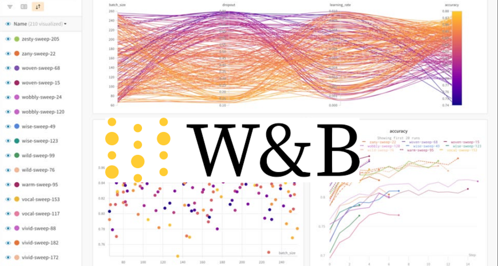

<div style="display: flex;">

<div style="flex: 1.5; padding-left:20px">

# CS190C Lec8
Weights & Biases (wandb)

</div>

<div style="flex: 1.8; padding-right:50px">

<p align="center">
    
</p>

</div>

</div>

---

## Overview

* Visualize model training
* Parameter tuning

---

## Part1: Visualize model training

---

We've implement a simple training script using huggingface libraries.

But we can only know some dull and abstracted numbers (such as loss) during training process, and it is hard to know some important information, such as descent speed of training/evaluation loss.

So we need a tool to visualize it.

---

## wandb

<div style="display: flex;">

<div style="flex: 2; padding-right: 5px;">

<p align="center">
    
</p>

</div>

<div style="flex: 1; padding-left: 5px;">

<br><br>

We can know the training process of all models at once.

</div>

</div>

---

## Projects-models

We report out training process to a certain project. That is: we use "Projects" to manage different training tasks.

<p align="center">
    
</p>

---

We've implement a training script at Lec7 using huggingface libraries. How can we make it able to report to wandb?

In fact, it is extremly easy because the library `Trainer` is able to automatically interact with wandb. So we just need to change a little.

---

## Configuration of wandb

We just need to add a few lines at the front of the script, before initialization of `Trainer`:

```Python
os.environ["WANDB_PROJECT"] = "bert-wikitext103-training"  
# Name of your project.
# Your training process will be recorded in this project space.
os.environ["WANDB_LOG_MODEL"] = "false"  
# Whether to upload the model file
```

Then, data preparation and model instantiation are not changed.

---

## Training arguments

```Python
training_args = TrainingArguments(
    output_dir="./bert-wikitext2-mlm",
    evaluation_strategy="epoch",
    learning_rate=2e-5,
    num_train_epochs=3,
    weight_decay=0.01,
    per_device_train_batch_size=16,
    per_device_eval_batch_size=16,
    fp16=True,
    # The above are normal training arguments
    
    # Necessary for wandb
    report_to="wandb", 
    run_name="run-v1-base",
    logging_steps=10,
)
```

---

## Finish synchronization
```Python
import wandb
wandb.finish()
```

Conclusion: Based on Trainer, we only need to add basic configuration and some related training arguments.

---

## PART2: Parameter tuning

---

Suppose we should tuning some hyperparameters and compare their behavoirs, we can create **sweeps** and use `yaml` file to control the tuning method.

---

## yaml script

<div style="display: flex;">

<div style="flex: 1; padding-right: 5px;">

```yaml
program: train.py
project: bert-wikitext-tuning
method: bayes

metric:
  name: eval/loss
  goal: minimize

command:
  - ${env}
  - ${interpreter} 
  - ${program}
  - ${args}
  - "--num_train_epochs"
  - "3"
  - "--per_device_train_batch_size"
  - "16"
  - "--per_device_eval_batch_size"
  - "16"
  - "--output_dir"
  - "./bert-sweep-checkpoints"
  - "--overwrite_output_dir"

parameters:
  learning_rate:
    distribution: uniform
    min: 1e-5
    max: 1e-4
  weight_decay:
    values: [0.001, 0.01, 0.1]
```

</div>

<div style="flex: 1; padding-left: 25px;">

<br><br>

Some important arguments:

* Python training scipt name to call
* wandb project name
* Hyperparameter searching method
* Tuning goal
* Normal command (like bash script)
* Parameters and tuning scope.

</div>

</div>

---

## Change of python script

We should change python script to make it able to run with out new yaml script:

* We should add an argument parser(provided by transformers library) instead of directly hard encode arguments in python script
* Instantiation of model and dataset should according to parsed arguments instead of hard encoded arguments
* Others are the same

---

## Libraries

```Python
import sys
import os
from dataclasses import dataclass, field # new added
from itertools import chain

from datasets import load_dataset
from transformers import (
    AutoConfig,
    AutoModelForMaskedLM,
    AutoTokenizer,
    DataCollatorForLanguageModeling,
    HfArgumentParser, # new added
    Trainer,
    TrainingArguments,
    set_seed,
)
```

---

## Parser

```Python
parser = HfArgumentParser((ModelArguments, DataArguments, TrainingArguments))  
model_args, data_args, training_args = parser.parse_args_into_dataclasses()
# Argument parser can automatically parse arguments and separate them into three classes above
```

But the parser cannot parse some arguments in out script: `model_name_or_path` `dataset_name` `block_size`. We should modify the parser rules to add these functions.

We will modify `ModelArguments` to make it able to parse `model_name_or_path`, modify `DataArguments` to make it able to parse `dataset_name` `block_size`.

---

## Parser

```Python
@dataclass
class ModelArguments:
    # Be able to parse argument model_name_or_path. If do not exist in script, filled with default value.
    model_name_or_path: str = field(
        default="bert-base-uncased",
        metadata={"help": "Path to pretrained model or model identifier from huggingface.co/models"}
    )

@dataclass
class DataArguments:
    dataset_name: str = field(
        default="KrisMinchev/wikitext-2-raw-v1",
        metadata={"help": "The name of the dataset to use (via the datasets library)."}
    )
    block_size: int = field(
        default=128,
        metadata={"help": "Optional input sequence length after tokenization."}
    )
```

---

## Data

```Python
datasets = load_dataset(data_args.dataset_name) # Change arguments
tokenizer = AutoTokenizer.from_pretrained(model_args.model_name_or_path) # Change arguments

def tokenize_function(examples):
    # Same as before

tokenized_datasets = datasets.map(
    tokenize_function,
    batched=True,
    num_proc=4,
    remove_columns=["text"],
)

block_size = data_args.block_size # Change arguments
def group_texts(examples):
    # Same as before

lm_datasets = tokenized_datasets.map(
    group_texts,
    batched=True,
    num_proc=4,
)
```

---

## Model and training

```Python
config = AutoConfig.from_pretrained(model_args.model_name_or_path) # Change arguments
model = AutoModelForMaskedLM.from_pretrained(model_args.model_name_or_path, config=config)
# Change arguments

data_collator = DataCollatorForLanguageModeling(
    tokenizer=tokenizer, mlm=True, mlm_probability=0.15
)

trainer = Trainer(
    model=model,
    args=training_args,
    train_dataset=lm_datasets["train"],
    eval_dataset=lm_datasets["validation"],
    tokenizer=tokenizer,
    data_collator=data_collator,
)

trainer.train()
metrics = trainer.evaluate()
```

---

## Start sweep

```bash
wandb sweep sweep.yaml
```
Then we create a sweep task in the project. And we may receive a message of how to run agent tasks.


```bash
kuangph@rtx6000:~/PT-Scaling$ wandb sweep sweep.yaml
wandb: Creating sweep from: sweep.yaml
wandb: Creating sweep with ID: lhw2r43w
wandb: View sweep at: https://wandb.ai/kuangpenghao-shanghaitech-university/pt-scaling-mup/sweeps/lhw2r43w
wandb: Run sweep agent with: wandb agent kuangpenghao-shanghaitech-university/pt-scaling-mup/lhw2r43w
```

That is: The sweep id is `lhw2r43w`. When we run the command line `wandb agent kuangpenghao-shanghaitech-university/pt-scaling-mup/lhw2r43w`, an agent will be create and run tuning task.