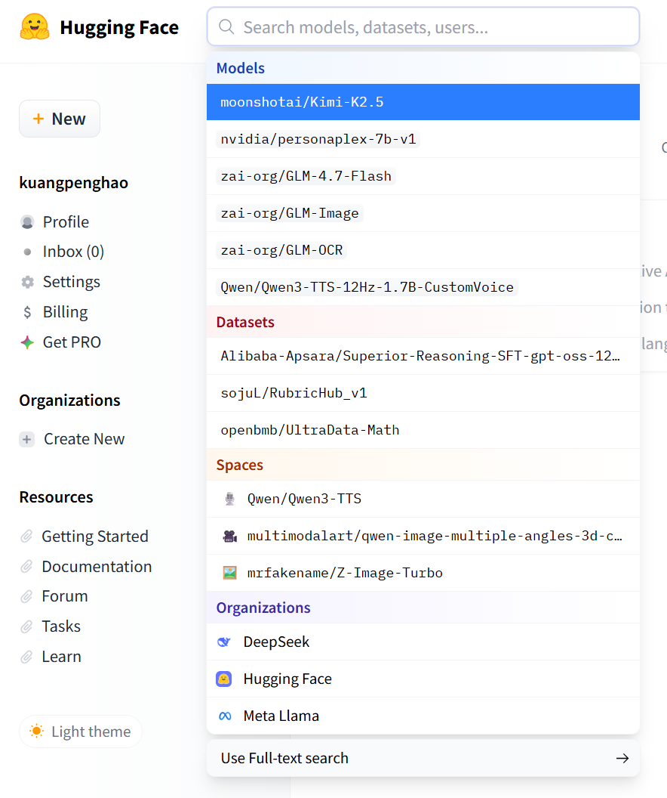
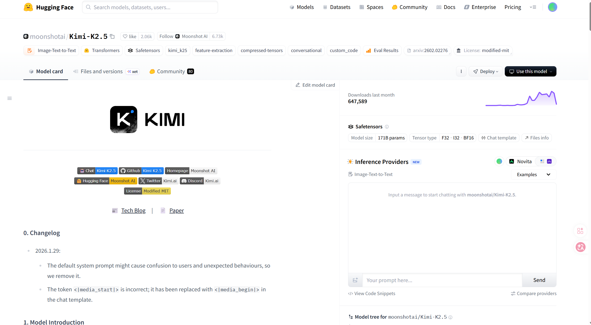
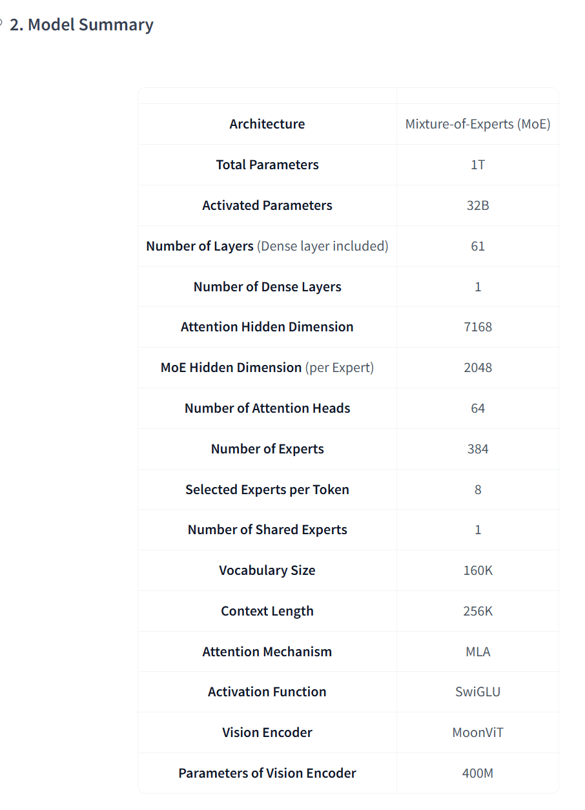
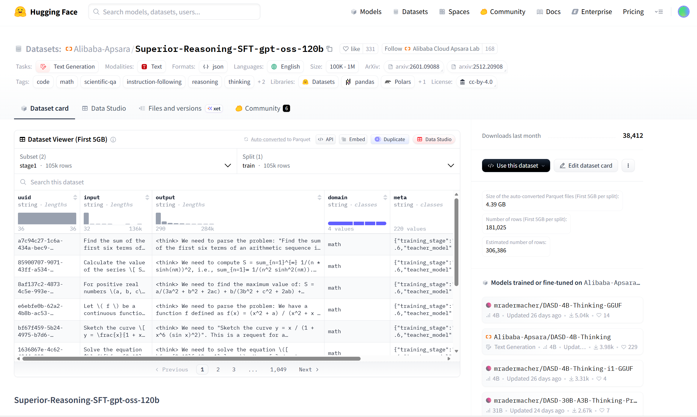
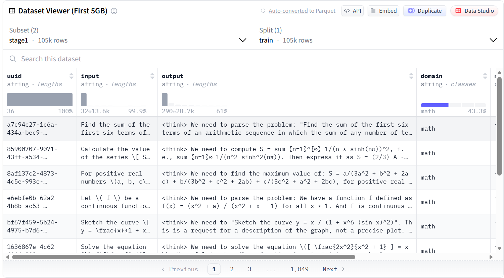
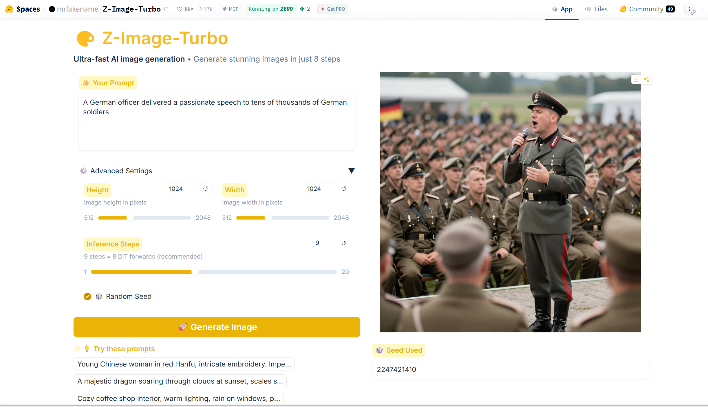
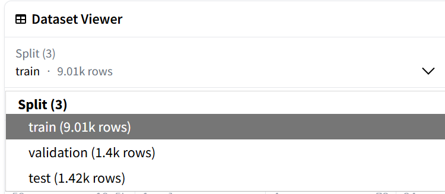

<div style="display: flex;">

<div style="flex: 1; padding-left: 20px;">

# CS190C Lec7

Hugging Face

</div>

<div style="flex: 1; padding-right: 100px;">

<p align="center">
    
</p>

</div>

</div>

---

## Overview

* HF Hub
* HF Libraries
  * Load a model: `transformers`
  * Prepare training data: `dataset`
  * Easily train a model: `Trainer`

---

## PART1: HF Hub

---

## What is huggingface?

<div style="display: flex;">

<div style="flex: 1.5; padding-right: 5px;">

Huggingface can be considered as `Github` of AI domain:

* You can browse a large number of models and datasets on the hub.
* You can download and upload models and datasets.
* Hugging face provide powerful library functions to help with it.

</div>

<div style="flex: 1; padding-left: 5px;">

<br>
<p align="center">
    
</p>


</div>

</div>

---

<div style="display: flex;">

<div style="flex: 1.6; padding-right: 5px;">

<br>

## What is huggingface?

On huggingface hub, you can search on the homepage.
* Models
* Datasets
* Spaces
* Organizations

</div>

<div style="flex: 1; padding-left: 5px;">

<br>
<p align="center">
    
</p>


</div>

</div>

---

## Models

Trained models which can directly use to run tasks.

For example: https://huggingface.co/moonshotai/Kimi-K2.5

<p align="center">
    
</p>

---

## Models

What can we know about this model?

<p align="center">
    
</p>

<div style="display: flex;">

<div style="flex: 1; padding-right: 5px;">

* Tasks: `Image-Text-to-text`. It is capable of multimodal task.
* Libraries: `Transformer` `Safetensors` and so on. The model is depend on these libraries.

</div>

<div style="flex: 1; padding-left: 5px;">

<p align="center">
    
</p>

</div>

</div>

---


<div style="display: flex;">

<div style="flex: 1;">

<br>

## Models

Refer to model card, we can find more informations of model. It is the same as `README.md` in github.

* Information of model
* Evaluation results
* Usage of model

</div>

<div style="flex: 1;">

<p align="center">
    
</p>

</div>

<div style="flex: 1;">

<p align="center">
    
</p>

</div>

</div>

---

## Datasets

Datasets which can directly use to train model.

For example: https://huggingface.co/datasets/Alibaba-Apsara/Superior-Reasoning-SFT-gpt-oss-120b

<p align="center">
    
</p>

---

## Datasets

Also, we can browse information, such as data, number of samples, size on model card page.

For example, we can get most information through Dataset Viewer.

<p align="center">
    
</p>

---

## Spaces

Some web applications based on trained model. You can visit and experience it.

For example: https://huggingface.co/spaces/mrfakename/Z-Image-Turbo

<p align="center">
    
</p>

---

<div style="display: flex;">

<div style="flex: 1; padding-right: 5px;">

<br><br>

## Organizations

Information, models, datasets of an organization.

For example: https://huggingface.co/meta-llama


</div>

<div style="flex: 1; padding-left: 5px;">

<p align="center">
    
</p>

</div>

</div>

---

In a word, we can browse all kinds of models and datasets on hugging face.

But how can we actually get access and make use of them?

We need libraries provided by hugging face.

---

## PART2: HF Libraries

---

## PART2.1: Load a model: `transformers`

---

## How to load a trained model?

What's the premise of succefully running a trained model?

* Model architecture and model task.
  * For example, model `bert-base-uncased`, running masked language modeling task.
* Config of model.
  * Number of layers, hidden size, vocabulary size and so on.
* Tokenizer of model.
* Finally, trained parameters.

---

## How to load a trained model?

Hugging face library `transformers` provides multiple `Auto` libraries, covering all operations above.
* `AutoConfig`
* `AutoTokenizer`
* `AutoModel` `AutoModelForCausalLM` `AutoModelForSequenceClassification` and so on

---

## Libraries and model-id

```
import torch
from transformers import AutoTokenizer, AutoModelForMaskedLM, AutoConfig

model_id = "bert-base-uncased"
```

This means:
* We will use model `bert-base-uncased` to run our language task.
* The language task to be run is `MaskedLM`

---

## Config

```
config = AutoConfig.from_pretrained(model_id)
```

We use `AutoConfig` to load configuration of this model. But how does it works?

* Check if `model_id` a local path. If it is, directly load this `json` configuration file.
* Check if `model_id` a local cached path then (The default path is `~/.cache/huggingface/`).
* Finally, send a request to huggingface to download `json` file to local directory.

---

<style scoped>
section * {
  font-size: 0.97em !important;
}
</style>

## Config

<div style="display: flex;">

<div style="flex: 1;">

```
{
  "architectures": [
    "BertForMaskedLM"
  ],
  "attention_probs_dropout_prob": 0.1,
  "directionality": "bidi",
  "hidden_act": "gelu",
  "hidden_dropout_prob": 0.1,
  "hidden_size": 768,
  "initializer_range": 0.02,
  "intermediate_size": 3072,
  "layer_norm_eps": 1e-12,
  "max_position_embeddings": 512,
  "model_type": "bert",
  "num_attention_heads": 12,
  "num_hidden_layers": 12,
  "pad_token_id": 0,
  "pooler_fc_size": 768,
  "pooler_num_attention_heads": 12,
  "pooler_num_fc_layers": 3,
  "pooler_size_per_head": 128,
  "pooler_type": "first_token_transform",
  "type_vocab_size": 2,
  "vocab_size": 21128
}
```

</div>

<div style="flex: 1">

* For `model_type`: 
    * It decides which kind of operation logic should be  followed.
* For `architectures`:
  * It decides task of language model and parameter architecture of task head.
* For other items:
  * It decides common configuration of model.

</div>

</div>

---

## Config
* `model_type`:  `bert` here corresponds to the code logic of `transformers.models.bert`, which can be found in https://github.com/huggingface/transformers/blob/main/src/transformers/models/bert/configuration_bert.py
  * `configuration_bert.py`: How to fill the raw decoded dictionary of `config.json` with default values, and instantiate it with `class BertConfig`.


---

## Config

* `architectures`: `BertForMaskedLM` here, corresponds to a bert model with a mask filling head.
  * If we use `AutoModelForMaskedLM`, parameters will be perfectly loaded.
  * If we use `AutoModel` (just load raw model without any head), parameters of mask filling head will be ignored.
  * If we use `AutoModelForSequenceClassification`, the missing classification head parameters will be randomly initialized.

---

## Tokenization

```
tokenizer = AutoTokenizer.from_pretrained(model_id)
```

Define tokenizer. Also obey the order of retrieving.

* First, decide which kind of tokenizer should be used (`BertTokenizer` here).
* Load the tokenization logic, which can be found in  https://github.com/huggingface/transformers/blob/main/src/transformers/models/bert/tokenization_bert.py, and instantiate the tokenizer.

---

## Model

```
model = AutoModelForMaskedLM.from_pretrained(
    model_id, 
    config=config
)
```

* Load model. As discussed before, it may throw a warning of random initialization of task head if we use `AutoModelForSequenceClassification`. If we use `AutoModelForMaskedLM`, it will be fine.
* https://github.com/huggingface/transformers/blob/main/src/transformers/models/bert/modeling_bert.py
* Till now, all parameters have loaded (except task head if we use `AutoModelForSequenceClassification`) with trained parameters. So what has class `AutoModel` done?

---

## Model

It can be separated as several steps:

* Configuration. `config = AutoConfig.from_pretrained("bert-base-uncased")` 
  * If we have explicitly configured, it can be ignored.
*  Choose model class (`BertForMaskedLM`) and instantiate the random initialized model.
* Download `pytorch_model.bin`/`model.safetensors` file containing trained parameters
* Load parameters.

---

## Inference

```
import torch
from transformers import AutoTokenizer, AutoModelForMaskedLM, AutoConfig

model_id = "bert-base-uncased"
config = AutoConfig.from_pretrained(model_id)
tokenizer = AutoTokenizer.from_pretrained(model_id)

text = "这家餐厅味道真不错！"
inputs = tokenizer(text, return_tensors="pt") 

with torch.no_grad():
    outputs = model(**inputs)

logits = outputs.logits
probabilities = torch.nn.functional.softmax(logits, dim=-1)
predicted_class_id = torch.argmax(probabilities, dim=-1).item()
print(f"Predicted ID: {predicted_class_id}")
```

---

However, if we want to actually train a model from scratch, we should need more libraries.

* `transformers` for model preparation
* `dataset` for data preparation
* `Trainer` for training arrangement

---

## PART2.2: Prepare training data: `dataset`

---

Suppose we are using dataset `iohadrubin/wikitext-103-raw-v1` to train a masked language model `"bert-base-uncased"`. How should we process the data?

* Load the original dataset
* Tokenization
* Grouping and trunking
* Dynamic masking
* Serving data

---

## Loading

```
from datasets import load_dataset
dataset = load_dataset("iohadrubin/wikitext-103-raw-v1")
```

But what's the basic structure of the object `dataset`?

We may observe a more complex dataset example `vesteinn/wikitext-220728-250728` first.

---

## Structure of dataset

<div style="display: flex;">

<div style="flex: 0.8; padding-right: 5px;">

<p align="center">
    
    
</p>

</div>

<div style="flex: 1; padding-left: 5px;">

* `dataset` is a dictionary with three keys: `train`,`validation`,`test`, just like 3 tables.
* Each table has columns `text`, `source` and so on, each column is a list.
* Each table has multiple rows, each row is a dictionary with keys `text`,`source` and so on.
* So a table can be called by `dataset["train"]`, a column can be called by `dataset["train"]["source"]`, a row can be called by `dataset["train"][0]`.

</div>

</div>

---

## Tokenization

```
def tokenize_function(examples):
    # Tokenize data of column "text", and also return special tokens mask.
    return tokenizer(examples["text"], return_special_tokens_mask=True)

# Use tokenize_function to run tokenization, process batch data parallely, use 4 CPU process.
# When finish processing, remove column "text".
tokenized_datasets = dataset.map(
    tokenize_function, 
    batched=True, 
    num_proc=4, 
    remove_columns=["text"]
)
```

Processed 'tokenized_datasets' is like:

```
{
  "input_ids": [[101, 791, 1921, 4685, 7231, 102], [101, 2769, 4638, 6821, 2769, 102]],
  "special_tokens_mask": [[1, 0, 0, 0, 0, 1], [1, 0, 0, 0, 0, 1]]
}
```

---

## Grouping & Chunking

<div style="display: flex;">

<div style="flex: 0.8">

<p align="center">
    
</p>

</div>

<div style="flex: 1;">

The length of setences are different. For simplicity, we directly grouping tokens of all tokenized sentences into a long string, and directly chunk them to `seq_len` blocks.

</div>

</div>

```
block_size = 128
def group_texts(examples):
    concatenated_examples = {k: list(chain(*examples[k])) for k in examples.keys()} ## directly concat tokens into a long string
    total_length = len(concatenated_examples[list(examples.keys())[0]]) ## get length of the long string
    if total_length >= block_size:
        total_length = (total_length // block_size) * block_size  ## discard tail of the string
      
    result = {
        k: [t[i : i + block_size] for i in range(0, total_length, block_size)]
        for k, t in concatenated_examples.items()
    } ## k is the key and t is the value (the long string, which is a list). For each list, chunk it into multiple blocks  and return. 
    return result

lm_datasets = tokenized_datasets.map(
    group_texts,
    batched=True,
    num_proc=4,
) ## The grouped and chunked dataset
```

---

## Dynamic masking

For BERT, actually we should do masking, but when?

If we do masking during `dataset.map` process (that is: implementing masking logic in tokenize_function), the model will receive static masking task, which is more possible to overfit.

So we do dynamic masking, which needs `DataCollatorForLanguageModeling` library in `transformers`

---

## Dynamic masking

Instantiate a data_collator function with masking probability 15%.
```
from transformers import DataCollatorForLanguageModeling

data_collator = DataCollatorForLanguageModeling(
    tokenizer=tokenizer, 
    mlm=True, 
    mlm_probability=0.15
)
```

And then, we are readied to train the language model with prepared `lm_datasets` and `data_collator`

---

## PART2.3: Easily train a model: `Trainer`

---

Things we should prepare for training is almost the same as discussed in Lec6.

* Training arguments
* Instantiated model
* Processed data
* Trainer

---

## Training arguments

For simplicity, we can define in python script, but we also recomment to define in a bash script.

<div style="display: flex;">

<div style="flex: 1; padding-right: 5px;">

```
from transformers import TrainingArguments

batch_size = 16 

training_args = TrainingArguments(
    output_dir="./bert-wikitext2-mlm",
    overwrite_output_dir=True, 

    # core arguments
    num_train_epochs=3,
    learning_rate=2e-5,
    weight_decay=0.01,
    per_device_train_batch_size=batch_size,
    per_device_eval_batch_size=batch_size,

```

</div>

<div style="flex: 1; padding-left: 5px;">

```
    # strategies of evaluation and saving
    evaluation_strategy="epoch", 
    save_strategy="epoch",
    load_best_model_at_end=True,

    fp16=True, 
    
    # strategies of logging
    logging_steps=100, 
    report_to="none", 
)
```

</div>

</div>

---

## Instantiated model

We've prepared the model before?

```
model = AutoModelForMaskedLM.from_pretrained(
    model_id, 
    config=config
)
```

But it is the pre-trained model, and we should load model with parameters just randomly initialized!

---

## Instantiated model

We've prepared config before:

```
config = AutoConfig.from_pretrained(model_id)
```

And we use `from_config` method to instantiate the model!

```
model = AutoModelForMaskedLM.from_config(config)
```

---

## Trainer

```
from transformers import Trainer

trainer = Trainer(
    model=model,
    args=training_args,
    train_dataset=lm_datasets["train"], # training data
    eval_dataset=lm_datasets["validation"], # evaluation data
    tokenizer=tokenizer, # we also save tokenizer in checkpoint
    data_collator=data_collator, # use data_collator to dynamically mask sentence
)
```

```
trainer.train()
eval_results = trainer.evaluate()
trainer.save_model("./final_bert_wikitext103")
```

---

## Official training scripts

We can directly get training scripts for training tasks like `CausalLM`,`MaskedLM` and so on provided by huggingface: https://github.com/huggingface/transformers/tree/main/examples/pytorch/language-modeling

These scripts has extremly strong function like training from scratch, fine-tuning, start training from checkpoint and distributed training.

We usually use them during daily research and industrial production.